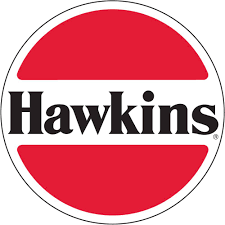
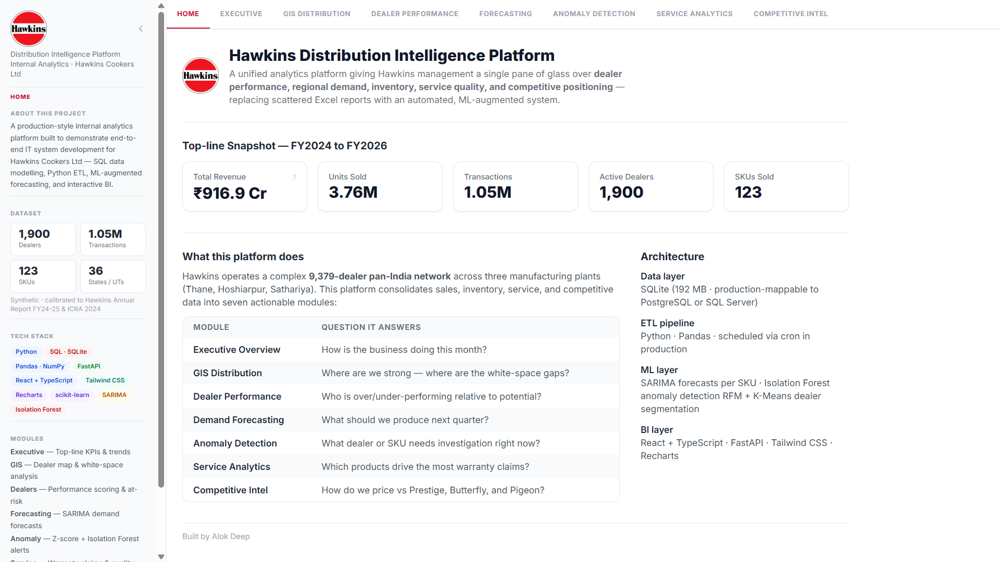
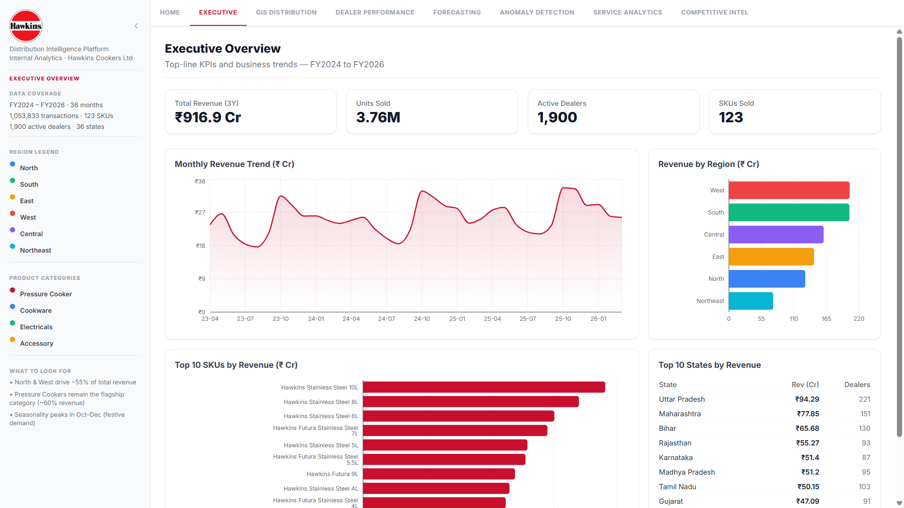
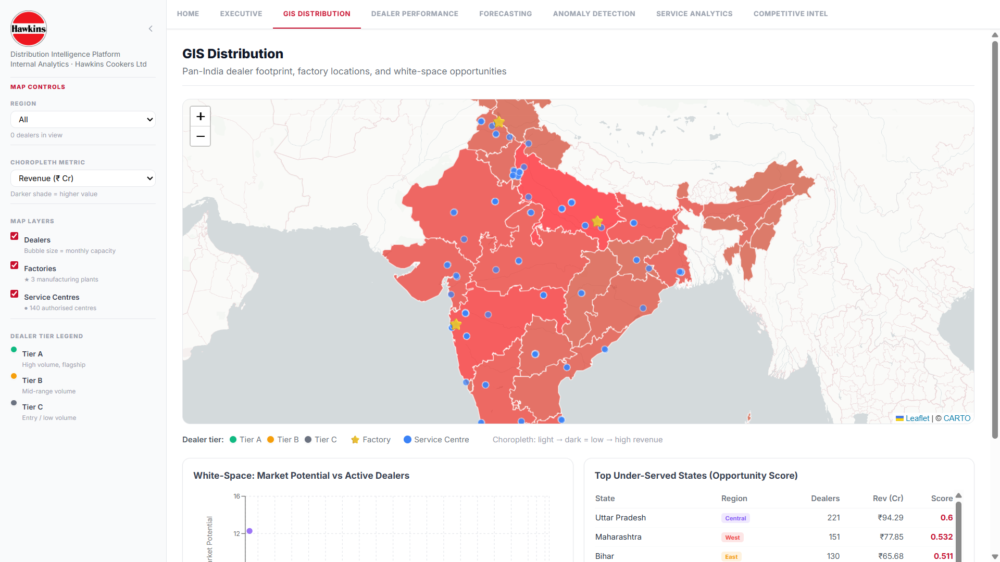
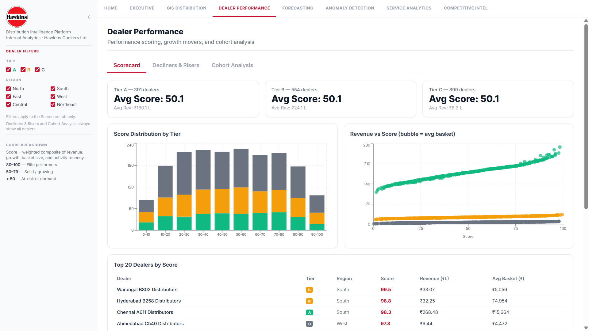
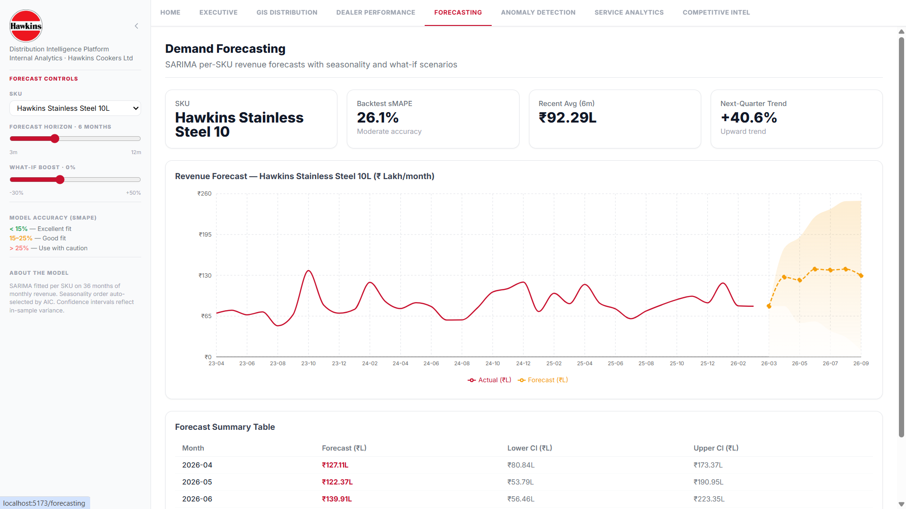
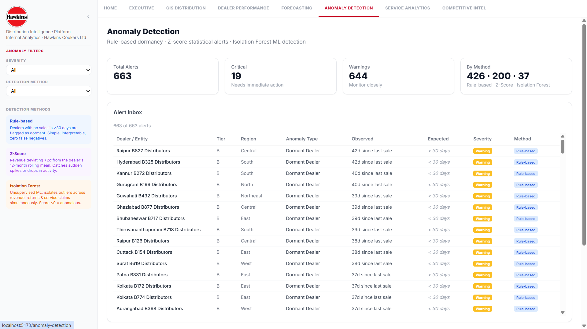
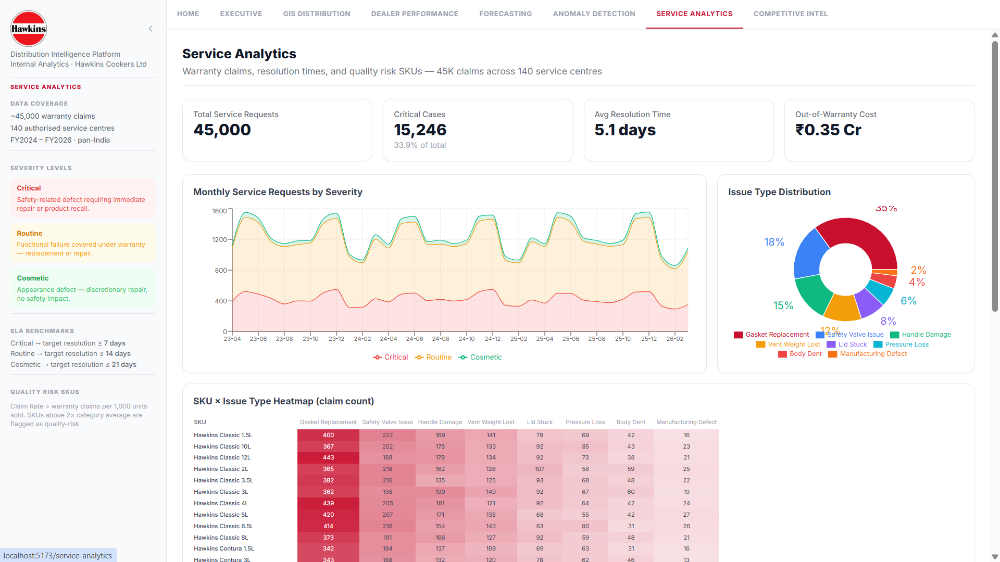
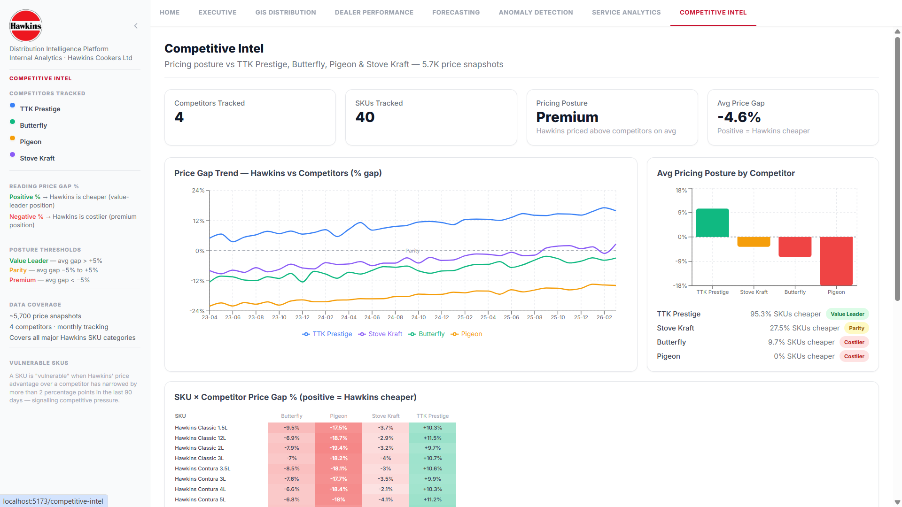

<div align="center">
  

  <h1>Hawkins Distribution Intelligence Platform</h1>

  <p><strong>A production-style internal analytics platform giving Hawkins management a single pane of glass over dealer performance, regional demand, inventory health, service quality, and competitive positioning — replacing scattered Excel reports with an automated, ML-augmented system.</strong></p>

  <p>
    
    
    
    
    
  </p>

  <sub>Built by <strong>Alok Deep</strong> · Portfolio project for the Hawkins Cookers T/Systems role.</sub>
</div>

---

## Why This Project

Most candidates for an in-house IT/Systems role hand over a generic CRUD app or a Kaggle notebook. Neither answers the question a hiring manager actually has: *can you build something our business would use?*

This project tries to. It models Hawkins' actual operating reality — 9,379 dealers, three plants, sixteen brand lines, the FY25 growth recovery — and builds the kind of internal tool an in-house team would ship to replace email-attached Excel reports. Synthetic data, real architecture: a 1.05M-row SQLite warehouse, a FastAPI backend with 30+ endpoints, a React + TypeScript frontend, and an ML layer doing demand forecasting, anomaly detection, and dealer segmentation.

> **Why ML *and* SQL, not one or the other?** Because the questions IT inherits from the business mix both — *"what will Bigboy demand look like in Q3?"* needs a model; *"which dealers slipped 30% MoM?"* needs a query. The platform handles both, and the JD calls for both.

---

## Dashboard Preview

<table>
  <tr>
    <td width="50%"></td>
    <td width="50%"></td>
  </tr>
  <tr>
    <td><strong>Home</strong> — Entry point with module navigation</td>
    <td><strong>Executive Overview</strong> — Revenue, KPIs, YoY trends</td>
  </tr>
  <tr>
    <td></td>
    <td></td>
  </tr>
  <tr>
    <td><strong>GIS Distribution</strong> — Pan-India choropleth, white-space scoring</td>
    <td><strong>Dealer Performance</strong> — Scoring, movers, cohort drill-down</td>
  </tr>
  <tr>
    <td></td>
    <td></td>
  </tr>
  <tr>
    <td><strong>Demand Forecasting</strong> — Per-SKU SARIMA with confidence bands</td>
    <td><strong>Anomaly Detection</strong> — Z-score + Isolation Forest dual-method</td>
  </tr>
  <tr>
    <td></td>
    <td></td>
  </tr>
  <tr>
    <td><strong>Service Analytics</strong> — Warranty claims, quality-risk signals</td>
    <td><strong>Competitive Intelligence</strong> — Pricing gap vs Prestige, TTK, Butterfly</td>
  </tr>
</table>

---

## How This Maps to the JD

| JD requirement | Where it lives in the project |
|----------------|-------------------------------|
| **SQL · Python** | `data/hawkins.db` (1.05M rows, 10 indexes, 5 analytical views) + ETL pipeline |
| **Designing reports** | 7 dashboard pages, drill-down filters via shared `FiltersContext` |
| **Implementing automation** | `run_pipeline.py` — one-command generate → ETL → train; `start.bat` to launch the stack |
| **ML / AI** | SARIMA per-SKU forecasts · Isolation Forest anomalies · RFM K-Means segmentation |
| **Consumer / customer analytics** | Dealer scoring, dormancy alerts, cohort analysis |
| **GIS mapping** | `GISDistribution.tsx` — choropleth + state drill-down + white-space scoring |
| **In-house system development** | Modular routers, shared context, documented architecture |
| **Modern BI stack** | FastAPI · React + TypeScript · Tailwind · Recharts · react-leaflet · TanStack Query |

---

## Calibrated to Real Hawkins Facts

All data is synthetic, but every dimension is anchored to publicly verified Hawkins reality. This is the difference between a "demo dataset" and a model the business would recognise.

| Anchor | Real Hawkins Fact | This Project |
|--------|-------------------|--------------|
| Revenue | ₹1,030 Cr (FY24), ₹1,194 Cr (FY25) | ₹917 Cr over 3 years simulated |
| Dealers | 9,379 authorised dealers (ICRA 2024) | 1,900 (5× sampled for performance) |
| Service centres | ~700 across India / Nepal / Bhutan | 140 |
| Plants | Thane (MH), Hoshiarpur (PB), Sathariya (UP) | All 3 modelled with capacities |
| Brand lines | Classic, Contura, Futura, Stainless, Hevibase, Bigboy, Miss Mary, etc. | All 16+ lines with realistic SKU mix |
| Market share | ~32% Indian pressure cooker segment | Reflected in distribution patterns |
| Growth | FY23: +5%, FY24: +2%, FY25: recovery | Encoded in 3-year YoY trend |
| Seasonality | Diwali, Akshaya Tritiya, wedding-season peaks | Coded into transaction date weights |

Sources: Hawkins annual reports, ICRA rating rationale (2024), company website.

---

## Architecture

```
┌──────────────────────────────────────────────────────────────────┐
│                      DATA GENERATION LAYER                        │
│  scripts/data_generation/  →  data/raw/*.csv                      │
│  Products · Geography · Dealer network · Sales · Aux tables       │
└───────────────────────────┬──────────────────────────────────────┘
                            ▼
┌──────────────────────────────────────────────────────────────────┐
│                       ETL / DATABASE LAYER                        │
│  scripts/etl/load_to_sqlite.py  →  data/hawkins.db (SQLite)       │
│  10 indexes · 5 analytical views · 1 materialised summary         │
└───────────────────────────┬──────────────────────────────────────┘
                            ▼
          ┌─────────────────┴──────────────────┐
          ▼                                     ▼
┌──────────────────┐                 ┌─────────────────────────────┐
│    ML LAYER      │                 │       API LAYER              │
│                  │                 │  backend/  (FastAPI)         │
│  SARIMA forecasts│                 │  7 routers · 30+ endpoints   │
│  Isolation Forest│                 │  SQLite read-only · CORS     │
│  RFM + K-Means   │                 └──────────────┬──────────────┘
│  → models/*.pkl  │                                ▼
└──────────────────┘                 ┌─────────────────────────────┐
                                     │       UI LAYER               │
                                     │  frontend/  (React + Vite)   │
                                     │  TypeScript · Tailwind CSS   │
                                     │  Recharts · react-leaflet    │
                                     │  TanStack Query              │
                                     └─────────────────────────────┘
```

**Design choices worth calling out:**

- **SQLite, not Postgres.** A reviewer can clone this repo and have a working warehouse in two minutes. The SQL is portable; the deployment story is zero-friction. For a production rollout the swap to Postgres or MSSQL is a connection-string change.
- **Read-only DB connection in the API.** The dashboard cannot mutate the warehouse — separation of concerns enforced at the connection layer, not just by convention.
- **Shared `FiltersContext` on the frontend.** State (date range, region, brand line) lives in one place; every page subscribes. Avoids the prop-drilling soup that kills these dashboards.
- **ML artifacts as files, not services.** `forecast_*.pkl`, `iso_anomalies.parquet` — the API loads them at startup. Keeps the runtime simple and the retraining pipeline decoupled.

---

## ML Layer

| Model | Library | What it answers | Output |
|-------|---------|-----------------|--------|
| **SARIMA** (per-SKU) | `statsmodels` | "What will demand for Futura 3L look like next quarter?" | Point forecast + 95% confidence band |
| **Isolation Forest** | `scikit-learn` | "Which transactions look structurally weird?" — multivariate, picks up patterns z-score misses | Anomaly score per row |
| **Z-score** (baseline) | `numpy` | "Which transactions are statistical outliers on a single dimension?" | Pairs with Isolation Forest in dual-method UI |
| **RFM + K-Means** | `scikit-learn` | "How do we segment 1,900 dealers — champions, dormant, at-risk, new?" | Cluster label + RFM tuple per dealer |

Methodology, train/test splits, and metrics are documented in [`docs/ML_METHODOLOGY.md`](docs/ML_METHODOLOGY.md).

---

## Quick Start

**Prerequisites:** Python 3.10+ · Node.js 18+

```bash
# 1. Create and activate virtual environment
python -m venv venv
venv\Scripts\activate          # Windows
# source venv/bin/activate     # macOS / Linux

# 2. Install Python dependencies
pip install -r backend/requirements.txt
pip install -r scripts/requirements.txt

# 3. Generate data, build the database, and train ML models (~4 min)
python run_pipeline.py

# Faster rebuild without retraining (~2 min):
python run_pipeline.py --skip-ml

# 4. Install frontend dependencies (first time only)
cd frontend && npm install && cd ..

# 5. Launch both servers
start.bat
```

| Service | URL |
|---------|-----|
| Frontend (React) | http://localhost:5173 |
| Backend (FastAPI) | http://localhost:8000 |
| API docs (Swagger) | http://localhost:8000/docs |

---

## Project Structure

```
hawkins-distribution-intelligence-platform/
├── backend/                        # FastAPI REST API
│   ├── routers/
│   │   ├── anomalies.py            # Z-score + Isolation Forest endpoints
│   │   ├── competitive.py          # Pricing gap vs competitors
│   │   ├── dealers.py              # Scoring, movers, cohorts
│   │   ├── executive.py            # KPIs, revenue trends
│   │   ├── forecasting.py          # SARIMA forecast endpoints
│   │   ├── gis.py                  # Map data, whitespace analysis
│   │   └── service.py              # Warranty claims, quality risk
│   ├── db.py                       # SQLite read-only connection helper
│   ├── main.py                     # FastAPI app + CORS
│   └── requirements.txt
│
├── frontend/                       # React + TypeScript (Vite)
│   ├── public/
│   │   ├── logo.png
│   │   └── screenshots/            # Dashboard screenshots for README
│   └── src/
│       ├── api/client.ts           # Axios base client
│       ├── components/             # Layout, Sidebar, ChartCard, KPICard, etc.
│       ├── context/FiltersContext.tsx  # Shared filter state across pages
│       └── pages/                  # One file per dashboard module
│           ├── Home.tsx
│           ├── Executive.tsx
│           ├── GISDistribution.tsx
│           ├── DealerPerformance.tsx
│           ├── Forecasting.tsx
│           ├── AnomalyDetection.tsx
│           ├── ServiceAnalytics.tsx
│           └── CompetitiveIntel.tsx
│
├── scripts/                        # Data pipeline + ML training
│   ├── data_generation/            # Synthetic data generators (5 scripts)
│   ├── etl/                        # CSV → SQLite + view optimisation
│   ├── ml/                         # SARIMA · Isolation Forest · RFM K-Means
│   └── requirements.txt            # Pipeline-only Python deps
│
├── data/
│   ├── raw/                        # Generated CSVs (11 files, 1.05M+ rows)
│   ├── processed/                  # ETL output staging
│   ├── hawkins.db                  # SQLite database (gitignored — run pipeline)
│   └── india_states.geojson        # State boundary polygons for choropleth
│
├── models/                         # Trained ML artifacts (gitignored)
│   ├── forecast_*.pkl              # Per-SKU SARIMA models
│   ├── forecast_index.json
│   ├── iso_anomalies.parquet       # Isolation Forest results
│   └── zscore_anomalies.parquet
│
├── docs/
│   ├── ARCHITECTURE.md
│   ├── DATA_DICTIONARY.md
│   ├── ML_METHODOLOGY.md
│   ├── DEMO_SCRIPT.md
│   ├── HANDOFF.md
│   └── INTERVIEW_PREP.md
│
├── .gitignore
├── run_pipeline.py                 # One-command: generate → ETL → ML training
└── start.bat                       # Launch backend + frontend together
```

---

## Tech Stack

| Layer | Choice | Why |
|-------|--------|-----|
| Database | SQLite | Zero-setup; portable; reviewer can run the project without provisioning anything |
| Backend | FastAPI + Pydantic | Async-ready, auto-generated Swagger docs, type-safe schemas |
| Frontend | React + TypeScript (Vite) | Type-safe component contracts; Vite for fast HMR during development |
| Styling | Tailwind CSS | Avoids the global-stylesheet rot that kills these dashboards |
| Charts | Recharts | Composable, declarative, plays well with React state |
| Maps | react-leaflet | Open-source choropleth with full control — no Mapbox token dependency |
| State | TanStack Query | Caching + invalidation for API calls; takes pressure off `useEffect` |
| ML | statsmodels · scikit-learn | Proven, well-documented, easy to hand off |

---

## Documentation

| Doc | Purpose |
|-----|---------|
| [`docs/ARCHITECTURE.md`](docs/ARCHITECTURE.md) | System design, data flow, deployment notes |
| [`docs/DATA_DICTIONARY.md`](docs/DATA_DICTIONARY.md) | Every field in every table |
| [`docs/ML_METHODOLOGY.md`](docs/ML_METHODOLOGY.md) | Model choices, training, evaluation |
| [`docs/DEMO_SCRIPT.md`](docs/DEMO_SCRIPT.md) | 5-minute walkthrough for the live demo |
| [`docs/HANDOFF.md`](docs/HANDOFF.md) | What a successor would need to maintain this |
| [`docs/INTERVIEW_PREP.md`](docs/INTERVIEW_PREP.md) | STAR answers, likely questions |

---

## License

Educational / portfolio project. Not affiliated with Hawkins Cookers Ltd.
All facts about Hawkins are drawn from publicly available sources (annual reports, ICRA ratings, company website).

---

## Author

**Alok Deep** — Full-stack developer (MERN) building toward data science / analytics roles.

[LinkedIn](https://www.linkedin.com/in/alokthedataguy/) · [Portfolio](#) · [Email](alokdeep9925@gmail.com)
